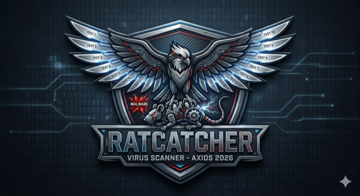

# RatCatcher



A PowerShell forensic scanner for detecting evidence of the **March 31, 2026 Axios NPM supply chain attack**, which distributed a malicious `plain-crypto-js` dependency via compromised versions of the `axios` package (v1.14.1 and v0.30.4). RatCatcher runs ten checks covering the full compromise kill chain and produces both a detailed technical report and an executive briefing.

You can read more about the attack here: https://thehackernews.com/2026/03/axios-supply-chain-attack-pushes-cross.html

---
NOTE: It is recommended that you stop and save all work before running.  This scan can take a very long time. Best to kick it off just before leaving for the day.
## Download and Install

### Prerequisites

- **Windows** (PowerShell 5.1 minimum; **PowerShell 7+ strongly recommended** for parallel processing — see [Performance](#performance) below)
- No additional modules required

### Option 1 — Clone with Git

```powershell
git clone https://github.com/mbfromit/NPM-Axios.git
cd NPM-Axios
```

### Option 2 — Download ZIP

1. Go to the repository on GitHub
2. Click **Code → Download ZIP**
3. Extract the ZIP to a folder of your choice (e.g. `C:\Tools\RatCatcher`)
4. Open PowerShell and `cd` into that folder

### Allow the Script to Run

If you haven't run unsigned PowerShell scripts before, you may need to adjust the execution policy for your session:

```powershell
Set-ExecutionPolicy -Scope Process -ExecutionPolicy Bypass
```

---

## Running the Scanner

### Basic scan (defaults to all of C:\, skips OS folders)

```powershell
.\Invoke-RatCatcher.ps1
```

The script will display the exact folders it intends to scan and ask for confirmation before starting.

### Scan a specific folder

```powershell
.\Invoke-RatCatcher.ps1 -Path C:\Dev
```

### Scan multiple folders

```powershell
.\Invoke-RatCatcher.ps1 -Path C:\Dev, C:\Projects, C:\Users\you\source
```

### Save reports to a custom location

```powershell
.\Invoke-RatCatcher.ps1 -OutputPath C:\IR\Reports
```

### Email the reports when done

```powershell
.\Invoke-RatCatcher.ps1 -SendEmail `
    -SMTPServer smtp.yourcompany.com `
    -FromAddress security@yourcompany.com `
    -ToAddress ir-team@yourcompany.com
```

Reports are always saved locally to `C:\Logs` (or `-OutputPath`) regardless of email settings.

---

## Performance

| PowerShell Version | Check 2 (lockfile analysis) |
|---|---|
| 5.1 | Sequential — can take 30–60 min on large machines |
| 7+ | Parallel (4 threads by default) — typically under 2 min |

To install PowerShell 7 side-by-side with your existing PS5.1:

```powershell
winget install Microsoft.PowerShell
```

Then run the scanner with `pwsh` instead of `powershell`:

```powershell
pwsh .\Invoke-RatCatcher.ps1
```

You can also adjust the thread count:

```powershell
pwsh .\Invoke-RatCatcher.ps1 -Threads 8
```

---

## What the Scanner Checks

### Check 1 — Discover Node.js Projects

Recursively walks every folder in the scan path looking for `package.json` files, skipping `node_modules` subdirectories to avoid false positives. This builds the complete list of Node.js projects on the machine that will be examined in checks 2 and 3.

### Check 2 — Lockfile Analysis

For every project found in check 1, the scanner examines whichever lockfile is present (`package-lock.json`, `yarn.lock`, or `pnpm-lock.yaml`) and looks for two specific indicators:

- **Vulnerable axios versions** — `1.14.1` or `0.30.4` (the two compromised releases published by the attacker)
- **Malicious plain-crypto-js** — version `4.2.1` (the RAT-dropping dependency injected via the compromised axios releases)

A hit here means the project _referenced_ a malicious package at install time. It does not confirm the package was actually installed — check 3 verifies physical presence.

### Check 3 — Forensic Artifact Detection (Project Level)

Examines the `node_modules` directory of each project for physical evidence of compromise:

- **Malicious package presence** — checks whether `node_modules/plain-crypto-js` actually exists on disk
- **Known-bad file hash** — if `plain-crypto-js/setup.js` is present, computes its SHA-256 and compares it against the known malicious hash (`e10b1fa8...`). A hash mismatch is flagged as High severity (possible variant), a match is Critical
- **C2 indicators in source files** — scans `.js` files across the project (including inside `plain-crypto-js`) for hardcoded references to the attacker's C2 domain `sfrclak.com` or IP `142.11.206.73`

### Check 4 — npm Cache and Global npm

Inspects two locations that persist evidence even after `npm uninstall`:

- **npm content-addressable cache** (`~/.npm/_cacache/index-v5`) — searches cache index entries for references to `plain-crypto-js-4.2.1.tgz`, `axios-1.14.1.tgz`, or `axios-0.30.4.tgz`. A hit means the malicious tarball was downloaded and cached, even if the project has since been cleaned up. Remediation: `npm cache clean --force`
- **Global npm install** — checks whether `axios` or `plain-crypto-js` is installed globally (`npm root -g`) and flags any installation at a vulnerable version as Critical

### Check 5 — Dropped Payload Search

The malicious `plain-crypto-js` setup script drops a Remote Access Trojan (RAT) to disk during `npm install`. This check scans `%TEMP%`, `%TMP%`, `%LOCALAPPDATA%`, and `%APPDATA%` for files created **after the attack window start (2026-03-31 00:21 UTC)** that match dropper behavior:

- **Executables and DLLs** — reads the first two bytes of every file and flags any with a PE/MZ header (`0x4D 0x5A`), regardless of file extension (severity: Critical)
- **Suspicious scripts** — flags `.ps1`, `.vbs`, `.bat`, and `.cmd` files created in temp locations after the attack window (severity: High)

### Check 6 — Persistence Mechanisms

If the RAT was executed, it will have attempted to establish persistence. This check examines three Windows persistence locations for artifacts created after the attack window or bearing suspicious characteristics:

- **Scheduled Tasks** — enumerates all non-Microsoft, non-disabled tasks. Flags tasks that were registered after the attack window, or that invoke living-off-the-land binaries (`powershell`, `wscript`, `cscript`, `mshta`, `rundll32`, `regsvr32`) from temp/appdata paths, or that use hidden window arguments (`-WindowStyle Hidden`, `-NonInteractive`)
- **Registry Run Keys** — inspects `HKCU\...\Run`, `HKLM\...\Run`, `HKCU\...\RunOnce`, and `HKLM\...\RunOnce` for entries that reference node, npm, or script files (`.ps1`, `.vbs`, `.bat`, `.cmd`, `.js`)
- **Startup Folders** — checks the user and all-users startup folders for any files added after the attack window

### Check 7 — XOR-Encoded C2 Indicators

The RAT is known to store its C2 configuration XOR-encoded to evade simple string searches. This check reads files from temp and appdata locations, decodes them using the attacker's known XOR scheme (key: `OrDeR_7077`, constant: `333`), and searches the decoded output for the C2 domain `sfrclak.com` and IP `142.11.206.73`. Scanned file types include `.exe`, `.dll`, `.bin`, `.dat`, `.ps1`, `.js`, `.vbs`, `.bat`, `.tmp`, and `.log`.

### Check 8 — Network Evidence

Looks for signs that the RAT has already communicated with the attacker's infrastructure:

- **Active TCP connections** — queries live network connections for any session currently open to `142.11.206.73` or port `8000` (the known C2 beacon port). If found, identifies the owning process by PID. An active connection means the RAT is running right now
- **DNS cache** — runs `ipconfig /displaydns` and searches the output for `sfrclak.com`. A cache hit means the machine resolved the attacker's domain at some point since the last DNS flush, indicating a connection attempt was made
- **Windows Firewall log** — if the firewall log is enabled (`C:\Windows\System32\LogFiles\Firewall\pfirewall.log`), searches it for any historical traffic to `142.11.206.73` and includes sample log lines as evidence

### Check 9 — Report Generation

Produces two output files in the report directory:

- **Technical forensic report** — full detail on every finding across all ten checks, including file paths, hashes, timestamps, severity ratings, and remediation commands
- **Executive briefing** — a concise summary suitable for management or incident response teams, covering scope, confirmed findings, and recommended actions

Both files are named with the hostname and timestamp for easy identification.

### Check 10 — Email Delivery

If `-SendEmail` was specified, emails both the technical report and the executive briefing as attachments via the configured SMTP server. The scan always completes and saves reports locally first; email failure does not affect local output.

---

## Exit Codes

| Code | Meaning |
|---|---|
| `0` | No compromise evidence found across all 10 checks |
| `1` | One or more Critical or lockfile findings detected — review reports immediately |

---

## Indicators of Compromise (IOC) Reference

| Indicator | Type | Description |
|---|---|---|
| `axios` v1.14.1 | npm package | Compromised release |
| `axios` v0.30.4 | npm package | Compromised release |
| `plain-crypto-js` v4.2.1 | npm package | Malicious RAT-dropping dependency |
| `e10b1fa84f1d6481625f741b69892780140d4e0e7769e7491e5f4d894c2e0e09` | SHA-256 | Known malicious `setup.js` |
| `sfrclak.com` | Domain | Attacker C2 domain |
| `142.11.206.73` | IP address | Attacker C2 server |
| `142.11.206.73:8000` | IP:Port | RAT beacon endpoint |
